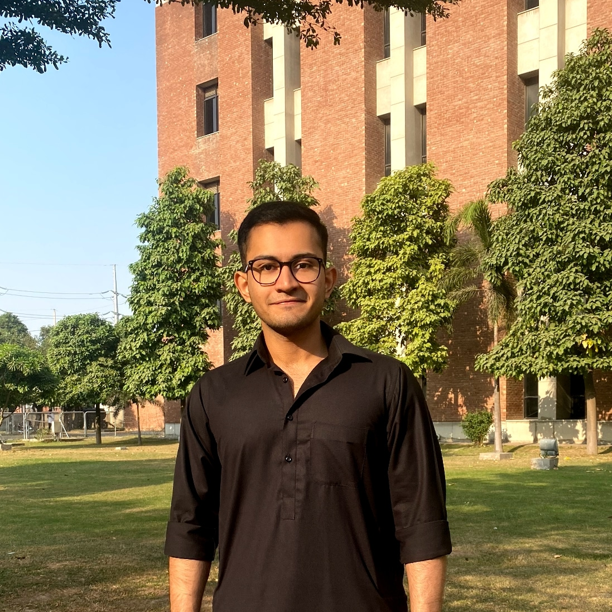

```{=html}
<style>
:root {
  --cv-ink: #172033;
  --cv-muted: #60708a;
  --cv-line: #dce3ee;
  --cv-surface: #f6f8fc;
  --cv-accent: #2165d7;
}

html[data-theme="dark"] {
  --cv-ink: #ecf2ff;
  --cv-muted: #aab8cf;
  --cv-line: #2a3953;
  --cv-surface: #151f31;
  --cv-accent: #77a7ff;
}

.quarto-title {
  text-align: left;
  font-size: clamp(2.5rem, 6vw, 3.65rem);
  font-weight: 800;
  letter-spacing: -.055em;
  margin-bottom: .12em;
  color: var(--cv-ink);
}

.quarto-title-block {
  text-align: left;
  margin-bottom: 1.25em;
}

.subtitle {
  font-size: 1.05em;
  color: var(--cv-muted);
  margin-bottom: .9em;
  font-weight: 600;
  letter-spacing: .01em;
}

.header-container {
  display: grid;
  grid-template-columns: 1fr auto;
  gap: 2rem;
  justify-content: space-between;
  align-items: flex-start;
  margin-bottom: 1.65em;
  padding: 1.45rem;
  border: 1px solid var(--cv-line);
  border-radius: 1rem;
  background: linear-gradient(135deg, var(--cv-surface), transparent 72%);
}

.header-left {
  flex: 1;
}

.header-right {
  flex-shrink: 0;
}

.profile-image {
  width: 132px;
  height: 132px;
  border-radius: 50%;
  object-fit: cover;
  border: 4px solid var(--cv-surface);
  box-shadow: 0 0 0 2px var(--cv-accent);
}

.social-links {
  display: flex;
  gap: .65rem 1.15rem;
  font-size: 0.95em;
  margin-top: .9em;
  flex-wrap: wrap;
}

.social-links a {
  color: var(--cv-ink);
  text-decoration: none;
  transition: color .2s ease;
  display: flex;
  align-items: center;
  gap: 0.4em;
}

.social-links a:hover {
  color: var(--cv-accent);
}

.social-links i {
  font-size: 1.1em;
}

.intro-text {
  max-width: 49rem;
  font-size: 1rem;
  line-height: 1.7;
  margin-bottom: 2.2em;
  color: var(--cv-muted);
}

.section-title {
  display: flex;
  align-items: center;
  gap: .75rem;
  font-size: 1.45em;
  font-weight: 800;
  letter-spacing: -.025em;
  margin-top: 2.2em;
  margin-bottom: .9em;
  color: var(--cv-ink);
}

.section-title::after {
  width: 2.5rem;
  height: 2px;
  background: var(--cv-accent);
  content: "";
}

.research-focus {
  font-size: 1em;
  line-height: 1.6;
  margin-bottom: 1.2em;
  color: var(--cv-muted);
}

.research-focus strong {
  color: var(--cv-ink);
}

.cv-entry {
  position: relative;
  margin-bottom: .8rem;
  padding: 1rem 1.15rem 1.05rem 1.3rem;
  border: 1px solid var(--cv-line);
  border-radius: .75rem;
  background: var(--cv-surface);
}

.cv-entry::before {
  position: absolute;
  top: 1rem;
  bottom: 1rem;
  left: 0;
  width: 3px;
  border-radius: 0 3px 3px 0;
  background: var(--cv-accent);
  content: "";
}

.cv-entry-title {
  font-weight: 750;
  font-size: 1.04em;
  color: var(--cv-ink);
}

.cv-entry-title a {
  color: var(--cv-ink);
  text-decoration: none;
}

.cv-entry-title a:hover {
  text-decoration: underline;
}

.cv-entry-org {
  margin-top: .16rem;
  color: var(--cv-muted);
  font-size: .91em;
  font-weight: 650;
}

.cv-entry-date {
  display: inline-block;
  margin-top: .55rem;
  padding: .2rem .5rem;
  border: 1px solid var(--cv-line);
  border-radius: 999px;
  color: var(--cv-muted);
  font-size: .73em;
  font-weight: 700;
  letter-spacing: .035em;
}

.cv-entry-description {
  color: var(--cv-muted);
  line-height: 1.55;
  margin-top: .65rem;
  font-size: .91em;
}

.cv-entry-description li {
  position: relative;
  margin: 0 0 .35rem;
  padding-left: 1.1rem;
  list-style: none;
}

.cv-entry-description li::before {
  position: absolute;
  left: 0;
  color: var(--cv-accent);
  content: "→";
}

.research-list {
  list-style: none;
  padding-left: 0;
}

.research-list li {
  margin-bottom: 0.8em;
  font-size: 1em;
  color: var(--cv-muted);
  line-height: 1.5;
}

.research-list li::before {
  content: "• ";
  color: var(--cv-accent);
  font-weight: bold;
  font-size: 1.2em;
  margin-right: 0.5em;
}

i, em {
  color: var(--cv-accent);
  font-style: normal;
  font-weight: bold;
}

@media (max-width: 560px) {
  .header-container { grid-template-columns: 1fr; gap: 1.2rem; }
  .header-right { grid-row: 1; }
  .profile-image { width: 92px; height: 92px; }
  .cv-entry { padding: .9rem 1rem .95rem 1.15rem; }
}

</style>

<div class="header-container">
  <div class="header-left">
    <div class="subtitle">MS Computer Science & Engineering | University of Michigan, Ann Arbor</div>
    
    <div class="social-links">
      <a href="https://www.linkedin.com/in/muhammad-khaquan-8601b6226/" target="_blank">
        <i class="bi bi-linkedin"></i> LinkedIn
      </a>
      <a href="https://github.com/KhaquanS/" target="_blank">
        <i class="bi bi-github"></i> GitHub
      </a>
      <a href="https://scholar.google.com/citations?user=XVVmWdcAAAAJ&hl=en" target="_blank">
        <i class="ai ai-google-scholar"></i> Google Scholar
      </a>
    </div>
  </div>
  
  <div class="header-right">
    
  </div>
</div>

<div class="intro-text">
I am an MS Computer Science and Engineering student at the University of Michigan, Ann Arbor. I earned my BS in Computer Science from LUMS in 2025 and previously served as a Teaching Fellow (junior faculty) in its CS department. My work spans efficient reasoning models, mechanistic interpretability, and reinforcement learning with verifiable rewards.
</div>


<h2 class="section-title">Education</h2>

<div class="cv-entry">
  <div class="cv-entry-title">MS Computer Science & Engineering</div>
  <div class="cv-entry-org">University of Michigan, Ann Arbor</div>
  <div class="cv-entry-date">September 2026 - Present</div>
</div>

<div class="cv-entry">
  <div class="cv-entry-title">Bachelor of Science in Computer Science</div>
  <div class="cv-entry-org">Lahore University of Management Sciences (LUMS)</div>
  <div class="cv-entry-date">September 2021 - July 2025</div>
  <div class="cv-entry-description">Graduated with a <i>CGPA of 3.72 (high distinction)</i></div>
</div>

<h2 class="section-title">Awards and Honors</h2>

<div class="cv-entry">
  <div class="cv-entry-title">Graduated with High Distinction</div>
  <div class="cv-entry-org">Lahore University of Management Sciences (LUMS)</div>
  <div class="cv-entry-date">July 2025</div>
  <div class="cv-entry-description">Among the top-25 people in my batch</div>
</div>

<div class="cv-entry">
  <div class="cv-entry-title">Dean's Honor List</div>
  <div class="cv-entry-org">Lahore University of Management Sciences (LUMS)</div>
  <div class="cv-entry-date">December 2022, December 2023, December 2024</div>
  <div class="cv-entry-description">Placed on the Dean's Honor List for every semester of my undergraduate degree</div>
</div>

<div class="cv-entry">
  <div class="cv-entry-title">USEFP High Achiever Award</div>
  <div class="cv-entry-org">United States Education Foundation Pakistan</div>
  <div class="cv-entry-date">January 2021</div>
  <div class="cv-entry-description">Among the highest SAT scores in the country (1560/1600) in my exam cycle</div>
</div>

<h2 class="section-title">Research Experience</h2>

<div class="cv-entry">
  <div class="cv-entry-title"><a href="https://github.com/KhaquanS/Reasoning-Distillation/tree/awesomeReasonDistill" target="_blank">ReasonDistill: Mechanistic Distillation of Reasoning</a></div>
  <div class="cv-entry-org">CSaLT + City @ LUMS - Research Lead</div>
  <div class="cv-entry-date">October 2025 - Present</div>
  <div class="cv-entry-description">
    <li>Leading a joint effort to distill reasoning capability from a <i>Qwen-3.5-4B teacher</i> into a <i>Qwen-3.5-2B student</i>.</li>
    <li>Developing a <i>mechanistic distillation</i> approach that isolates reasoning-relevant model components before transfer.</li>
    <li>Current runs outperform <i>off-policy distillation by up to 2%</i> on ARC-C, GSM8K, MMLU, MATH-500, and HellaSwag.</li>
  </div>
</div>

<div class="cv-entry">
  <div class="cv-entry-title"><a href="https://github.com/KhaquanS/WH-DisDKD" target="_blank">DisDKD: Discriminator based exploration of DKD</a></div>
  <div class="cv-entry-org">City@LUMS - Research Lead</div>
  <div class="cv-entry-date">September 2025 - Present</div>
  <div class="cv-entry-description">
    <li><i>Leading a research group</i> of 3 junior researchers picked from the Advanced Topics in ML course</li>
    <li>We are trying to inculcate <i>explicit feature alignment</i> in Decoupled-KD</li>
    <li>Designed a <i>discriminator</i> based approach <i>to align the feature distribution</i> of the hint generator (teacher backbone) with the guided generator (student backbone)</li>
    <li>Introduced a <i>contrastive</i> component in the <i>discriminator</i> loss to <i>address the mode collapse issue</i></li>
    <li><i>Outperforming FitNets and Decoupled-KD</i> on 3 standard image classification benchmarks</li>
  </div>
</div>

<div class="cv-entry">
  <div class="cv-entry-title"><a href="https://github.com/KhaquanS/fitnet-sae_injection" target="_blank">AENets: Autoencoder-Based Compression of Large Networks</a></div>
  <div class="cv-entry-org">City @ LUMS - Research Lead</div>
  <div class="cv-entry-date">July 2025 - Present</div>
  <div class="cv-entry-description">
    <li>Developed lightweight hybrid architectures using large pretrained teachers.</li>
    <li>Approaching teacher performance on three image-classification benchmarks and SOTA OOD results at compression ratios up to 100×.</li>
  </div>
</div>

<div class="cv-entry">
  <div class="cv-entry-title"><a href="https://arxiv.org/abs/2408.08454" target="_blank"> DGQA: Dynamic Grouped Query Attention</a></div>
  <div class="cv-entry-org">CSALT - Research Intern</div>
  <div class="cv-entry-date">August 2024 - December 2024</div>
  <div class="cv-entry-description">
    <li>Proposed an <i>incremental upgrade</i> to Grouped Query Attention (GQA) by allowing <i>dynamic allocations of groups during uptraining</i> of GQA</li>
    <li>Showed non-trivial gains across multiple models and benchmarks in ViTs (used ViTs instead of LLMs due to computational constraints)</li>
    <li><i>Multiple citations</i> via arxiv</li>
  </div>
</div>


<div class="cv-entry">
  <div class="cv-entry-title"><a href="https://github.com/omertafveez-2001/Decoupled-Gradient-Knowledge-Distilation" target="_blank"> G-DKD: Gradient Decoupled KD</a></div>
  <div class="cv-entry-org">City@LUMS - Research Intern</div>
  <div class="cv-entry-date">September 2024 - January 2025</div>
  <div class="cv-entry-description">
    <li>Made an <i>incremental change on top of Decoupled-KD</i> by decoupling even at the gradient level</li>
    <li>We got the gradient of student target logits in the TCKD loss and non-target logits in the NCKD loss and tried to <i>diverge</i> these two <i>gradient terms by maximising the L2 distance</i> between them</li>
    <li>Ended the project as we only saw trivial gains over vanilla Decoupled-KD</li>
  </div>
</div>


<h2 class="section-title">Teaching Experience</h2>

<div class="cv-entry">
  <div class="cv-entry-title">Teaching Fellow - Computer Science</div>
  <div class="cv-entry-org">Fundamentals of Object-Oriented Programming (CS 200) · LUMS</div>
  <div class="cv-entry-date">January 2026 - July 2026</div>
  <div class="cv-entry-description">
    <li>Co-taught <i>400 first-year students</i> in object-oriented programming.</li>
    <li>Designed and ran <i>14 C/C++ labs</i> across two sections.</li>
    <li>Designed and graded <i>two midterms and one final exam</i>.</li>
    <li>Led bi-weekly tutorials reinforcing lecture content and assignment-specific programming concepts.</li>
  </div>
</div>

<div class="cv-entry">
  <div class="cv-entry-title">Teaching Fellow - Computer Science</div>
  <div class="cv-entry-org">Data Structures (CS 202) · LUMS</div>
  <div class="cv-entry-date">July 2025 - December 2025</div>
  <div class="cv-entry-description">
    <li>Co-taught data structures in C/C++ to <i>312 sophomore students</i>.</li>
    <li>Led weekly tutorials reinforcing lectures and introducing assignment-specific programming concepts.</li>
    <li>Designed and graded <i>two midterms and one final exam</i>.</li>
  </div>
</div>

<div class="cv-entry">
  <div class="cv-entry-title">Adjunct Faculty - Computer Science</div>
  <div class="cv-entry-org">Masters in AI Bootcamp</div>
  <div class="cv-entry-date">August 2025</div>
  <div class="cv-entry-description">
    <li><i>Lead instructor</i> to a class of 110 incoming graduate students for AI</li>
    <li>Delivered <i>lectures</i> covering the basics of <i>programming</i> in python, <i>probability theory</i> and <i>multi-variable calculus</i></li>
  </div>
</div>

<div class="cv-entry">
  <div class="cv-entry-title">Lead Teaching Assistant - Computer Science</div>
  <div class="cv-entry-org">Fundamentals of Generative AI (CS 5306)</div>
  <div class="cv-entry-date">January 2025 - May 2025</div>
  <div class="cv-entry-description">
    <li>Collborated with Dr. Agha Ali Raza to <i> redesign his popular graduate level course on generative language models</i></li>
    <li><i>Revamped programming assingments</i> and introduced a coherent flow - build embedding models, then Smol Llama, LoRA on Smol Llama, and then perform PPO on Smol Llama</li>
    <li><i>Designed</i> majority of the <i>quizzes and paper reading assignments</i></li>
  </div>
</div>

<div class="cv-entry">
  <div class="cv-entry-title">Teaching Assistant - Computer Science</div>
  <div class="cv-entry-org">Machine Learning (CS 436)</div>
  <div class="cv-entry-date">September 2024 - December 2024</div>
  <div class="cv-entry-description">
    <li><i>Developed a programming assignment</i> which constrcuted Feed-forward networks from scratch in numpy</li>
    <li><i>Delivered</i> a seires of <i>highly popular tutorials</i></li>
  </div>
</div>


<h2 class="section-title">Industry Experience</h2>

<div class="cv-entry">
  <div class="cv-entry-title">Machine Learning Engineer</div>
  <div class="cv-entry-org">WhichDraft</div>
  <div class="cv-entry-date">June 2023 - January 2024</div>
  <div class="cv-entry-description">
    <li>Established an <i>end-to-end pipeline with OpenAI API</i> to automate legal contract generation using AI powered agents</li>
    <li>Developed a vanilla agent which <i>automated taxonomy generation by 90%+</i> leading to custom legal contract generation</li>
    <li>Developed an editor agent to integrate client instructions into generated contracts, <i>enhancing satisfaction by 70%+</i></li>
    <li>Developed an MVP Agent which enabled contract wide and component specific customizations, <i>boosting user engagement by 52%</i> and <i>reducing support inquiries by 25%</i></li>
  </div>
</div>

<div class="cv-entry">
  <div class="cv-entry-title">Machine Learning Engineer</div>
  <div class="cv-entry-org">Zeta Solutions</div>
  <div class="cv-entry-date">March 2023 - April 2023</div>
  <div class="cv-entry-description">
    <li>Developed a notebook to be used in <i>demonstration of AI agent capabilities</i> using LangChain and GPT-4 API for a class of <i>over 150 students</i></li>
    <li>Established an agent executor to incorporate memory and instruction recall thus <i>boosting response quality by 40%+</i></li>
  </div>
</div>

<div class="cv-entry">
  <div class="cv-entry-title">Machine Learning Engineer</div>
  <div class="cv-entry-org">Environ AI</div>
  <div class="cv-entry-date">January 2023 - February 2023</div>
  <div class="cv-entry-description">
    <li>Created a chatbot for navigating a corpus of <i>1 million+ legal documents</i> to facilitate client's green policy decisions</li>
    <li><i>Improved model throughput by 42%</i> by employing a semantic hashing protocol to shortlist relevant documents</li>
    <li>Conducted <i>Retrieval Augmented Generation</i> on the shortlisted documents to respond to client queries</li>
  </div>
</div>

```
